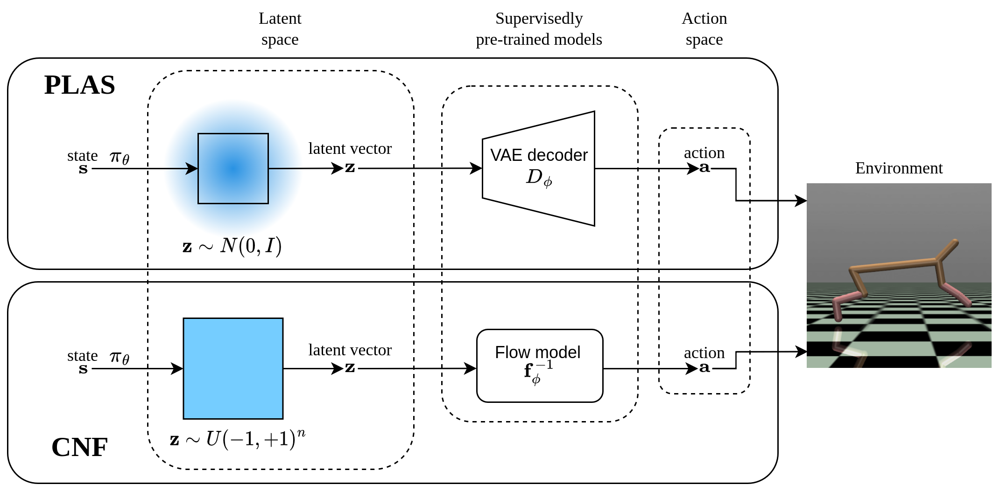
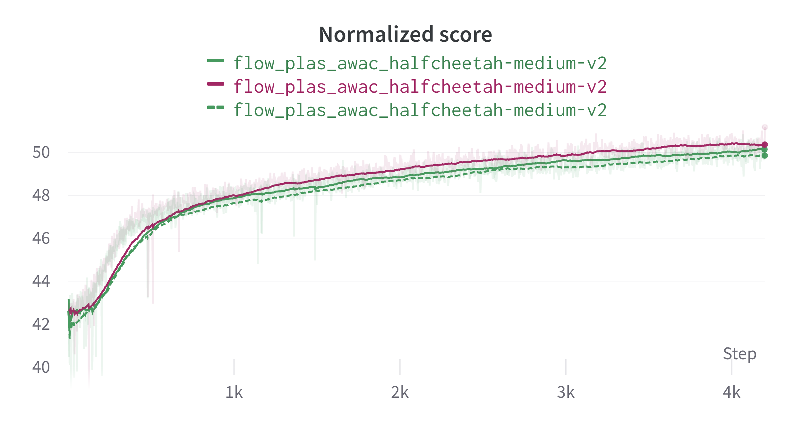
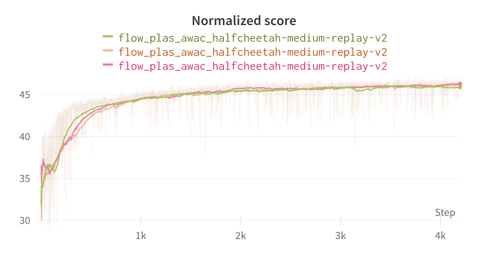
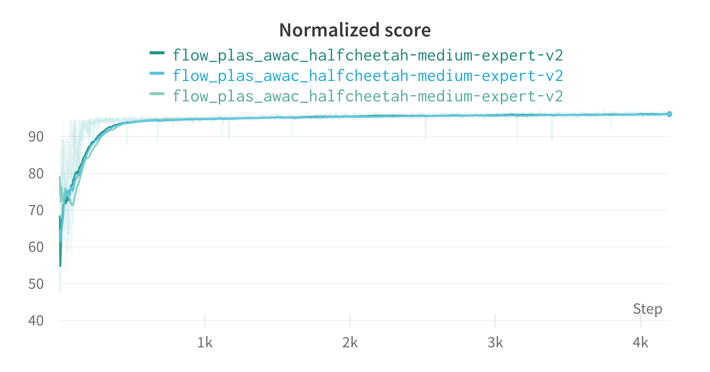

# Conservative Normalizing Flows

An official implementation for [Conservative Normalizing Flows (CNF)](https://arxiv.org/abs/2211.11096).

____



## How to use

Clone the repo, run docker and install requirements:
```bash
cd docker/
./docker_run.sh
docker exec -it flows bash
cd docker/
install.sh
```
### Single model runs:
1) To pre-train single Normalizing Flow model on the offline dataset:
```bash
python configs/run_flow.py --env_name <env_name to train on>
```
2) Select the best checkpoint from Normalizing Flow pre-training and copy it to ```flow_checkpoints/``` directory using environment name: ```flow_checkpoints/halfcheetah-medium-expert-v2.pt``` for example.
3) To run single RL CNF training run:
```bash
python configs/run_rl.py --env_name <env_name to train on>
```

### Hyperparameter search
1) To pre-train NF models run
```bash
python configs/sweep_flow.py --env_name <env_name to train on> --n_epoch <number of training epochs>
```
This command print sweep id into the terminal. Copy and paste it into ```configs/run_sweep_flow.py``` as ```sweep_id``` parameter and run
```bash
python configs/run_sweep_flow.py
```
2) Select the best checkpoint from Normalizing Flow pre-training and place it to ```flow_checkpoints/``` directory.
3) Run following command, it will print RL sweep it. Copy and paste it into ```configs/run_sweep_rl.py``` as ```sweep_id``` parameter
```bash
python configs/sweep_rl.py
```
4) Run
```bash
python configs/run_sweep_rl.py
```


## Expected results
<p align="left">



<i>Halfcheetah environment</i>
</p>

## Citing
If you find this code useful, please cite our paper:
```
@article{akimov2022let,
  title={Let Offline RL Flow: Training Conservative Agents in the Latent Space of Normalizing Flows},
  author={Akimov, Dmitriy and Kurenkov, Vladislav and Nikulin, Alexander and Tarasov, Denis and Kolesnikov, Sergey},
  journal={arXiv preprint arXiv:2211.11096},
  year={2022}
}
```

## Note
+ If you have any questions, please contact us at v.kurenkov@tinkoff.ai
